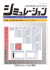

<h2>Books</h2>

<ul>
    <li style="clear:both;"><a href="https://github.com/taroyabuki/webbook">矢吹太朗. Webのしくみ&mdash;Webをいかすための12の道具. サイエンス社, 2020.</a></li>
    <li style="clear:both;"><a href="https://github.com/taroyabuki/cppbook2">矢吹太朗. 基礎からしっかり学ぶC++の教科書. 日経BP, 2017.</a></li>
    <li style="clear:both;"><a href="https://taroyabuki.github.com/webbook2/">矢吹太朗. Webアプリケーション構築入門&mdash;実践！Webページ制作からマッシュアップまで. 森北出版, 2011.</a></li>
    <li style="clear:both;">矢吹太朗. Microsoft Visual C++入門（マイクロソフト公式解説書）. 日経BPソフトプレス, 2009. <a href="https://web.archive.org/web/20100224214732/https://wings.msn.to/index.php/-/A-05/978-4-89100-626-6/">正誤表</a></li>
    <li style="clear:both;">矢吹太朗. Microsoft Visual Web Developer 2008 Express Edition入門（マイクロソフト公式解説書）. 日経BPソフトプレス, 2008. <a href="https://web.archive.org/web/20081112015032/https://wings.msn.to/index.php/-/A-05/978-4-89100-584-9/">正誤表</a></li>
    <li style="clear:both;">矢吹太朗. 初級プログラマのためのWebアプリケーション構築入門&mdash;実践で学ぶJava, XHTML, SQL. 森北出版, 2007. <a href="https://web.archive.org/web/20100311025524/http://www.unfindable.net/web-app-book/wiki/%E6%AD%A3%E8%AA%A4%E8%A1%A8">正誤表</a></li>
</ul>

<h2 style="clear:both;">Selected Papers</h2>

<ul>
    <li><a href="https://dbsj.org/journal/dbsj_journal/dbsj_journal_vol_9_no_2_13_18/">矢吹太朗, 佐久田博司. SQLによる数独の解法とクエリオプティマイザの有効性. 日本データベース学会論文誌. Vol.9, No.2, pp.13&ndash;18, 2010.</a></li>
    <li><a href="http://www.jcomputers.us/index.php?m=content&c=index&a=show&catid=85&id=1060">Taro Yabuki and Hiroshi Sakuta. Development of Collaboration Environments for Web-Based Learning. <em>Journal of Computers,</em> Vol. 2, No. 9, pp. 1&ndash;6, Academy Publisher, 2007.</a></li>
    <li><a href="https://www.amazon.co.jp/exec/obidos/asin/1591403138/">Taro Yabuki and Hitoshi Iba. Genetic programming using a Turing complete representation: recurrent network consisting of trees. In Leandro Nunes de Castro and Fernando J. Von Zuben, editors, <em>Recent Developments in Biologically Inspired Computing,</em> chapter 4, pp. 61&ndash;81. Idea Group Inc., 2004.</a></li>
    <li>矢吹太朗, 伊庭斉志. 関数の回帰的なネットワークを用いた言語判定装置の生成. 情報処理学会論文誌：数理モデル化と応用, Vol. 45, No.SIG02, pp. 66&ndash;76, 2004.</li>
    <li>Taro Yabuki and Hitoshi Iba. Turing-complete data structure for genetic programming. In <em>Proceedings of 2003 IEEE International Conference on System, Man &amp; Cybernetics (SMC 2003),</em> pp. 3577&ndash;3582, Washington, D.C., USA, October 2003.</li>
    <li>矢吹光佑, 矢吹太朗. 実ネットワークの大局的性質を再現する創発モデル. 情報処理学会研究報告（情処研報）, Vol.2004, No.85, pp. 211&ndash;218. 情報処理学会知能と複雑系研究会，人工知能学会知識ベースシステム研究会共催, 2004. <a href="paper/2004-yabuki-emergent_model.pdf">PDF</a></li>
    <li>Taro Yabuki and Hitoshi Iba. Genetic algorithms for quantum circuit design&mdash;evolving a simpler teleportation circuit. In Darrell Whitley, editor, <em>Late Breaking Papers at the 2000 Genetic and Evolutionary Computation Conference (GECCO 2000),</em> pp. 425&ndash;430, Las Vegas, Nevada, USA, August 2000.</li>
</ul>

<h2>Theses</h2>

<ul>
    <li>Representation Schemes for Evolutionary Automatic Programming. Ph.D. Thesis, The University of Tokyo, Department of Frontier Informatics, Graduate School of Frontier Sciences, 2004. (<a href="thesis/abstract_en.pdf">abstract</a>) （進化計算による自動プログラミングのための表現の研究. 博士論文, 東京大学大学院 新領域創成科学研究科 基盤情報学専攻, 2004. <a href="thesis/abstract_ja.pdf">概要</a>）</li>
    <li>遺伝的アルゴリズムによる量子計算のための自動回路生成. 修士論文, 東京大学大学院 新領域創成科学研究科 基盤情報学専攻, 2001.</li>
</ul>

<h2>Invited lecture</h2>

情報教育におけるクラウドの活用. <a href="https://www.ipa.go.jp/about/press/20110209.html">IPA中小企業クラウドセキュリティシンポジウム2011（IPA情報セキュリティ月間記念シンポジウム2011）</a>. 情報処理推進機構, 2011年2月25日.（ベルサール飯田橋）

<h2>Commentary</h2>

<ul>
    <li style="clear:both;">機械まかせの数学. 大学への数学, Vol. 61, No. 5, pp. 66&ndash;69, 6月 2017.</li>
    <li style="clear:both;"> 矢吹太朗, 伊庭斉志. Swarmによる複雑系のシミュレーション. シミュレーション, Vol. 23, No. 3, pp.7&ndash;12, 9月 2004.</li>
    <li style="clear:both;">矢吹太朗, 伊庭斉志. 量子コンピュータってどんなもの？ 映像情報メディア学会誌, Vol.55, No. 8/9, pp. 1113&ndash;1114, 2001.</li>
</ul>

<h2>Translation</h2>

群れが生み出す知能. 日経サイエンス, 7月号, pp. 18–26, 2000. (Eric Bonabeau and Guy Theraulaz. Swarm smarts. <em>Scientific American,</em> p. 54, March 2000.)

<h2>Others</h2>

<ul>
    <li><a href="https://taroyabuki.github.io/OneMaps/">One Maps—One Map with multiple web browserS</a></li>
    <li>ウェブコミュニケーションの未来—便利さとプライバシーのトレードオフ？—. NEWS SOKEN, Vol.10-2, pp. 8–9, 青山学院大学総合研究所, 2011. <a href="https://web.archive.org/web/20160827064912/http://www.ri.aoyama.ac.jp/shihan1/nsoken10-2.pdf">PDF</a></li>
    <li><a href="http://blog.unfindable.net/archives/804">3次元版Twitearth この星のつぶやき</a></li>
    <li><a href="https://web.archive.org/web/20080430221304/http://codezine.jp:80/a/article/aid/1910.aspx">PCとスパコンの無理矢理な比較. <em>CodeZine,</em> 2007.</a></li>
    <li><a href="https://github.com/taroyabuki/penrose_utm">ペンローズ『皇帝の新しい心』の万能テューリング機械</a></li>
    <li><a href="http://blog.unfindable.net/archives/268">バベルのコンピューター</a></li>
    <li><a href="no_free_lunch.pdf">No Free Lunch Theorem—理想の＊＊の探し方</a></li>
    <li><a href="why_lisp/">なぜ Lisp なのか</a></li>
    <li><a href="self/">自分のコードを出力するプログラム</a></li>
    <li><a href="unknowable/">不完全性定理のLisp, Mathematicaによる記述</a></li>
    <li><a href="swarm/">Swarmについてのメモ</a></li>
</ul>

<h3>Sudoku</h3>

<ul>
    <li><a href="https://web.archive.org/web/20080504051222/http://codezine.jp:80/a/article/aid/1627.aspx">SQLによる数独の解法. <em>CodeZine,</em> 2007.</a></li>
    <li><a href="https://web.archive.org/web/20080504051458/http://codezine.jp:80/a/article/aid/1628.aspx">SQLによる数独の高速解法. <em>CodeZine,</em> 2007.</a></li>
    <li><a href="https://web.archive.org/web/20080720073431/http://codezine.jp:80/a/article/aid/1629.aspx">動的SQLによる数独の超高速解法. <em>CodeZine,</em> 2007.</a></li>
    <li><a href="https://dbsj.org/journal/dbsj_journal/dbsj_journal_vol_9_no_2_13_18/">矢吹太朗, 佐久田博司. SQLによる数独の解法とクエリオプティマイザの有効性. 日本データベース学会論文誌. Vol.9, No.2, pp.13–18, 2010.</a></li>
</ul>

<h3>Music criticism</h3>

<ul>
    <li style="clear:both;"><a href="https://www.amazon.co.jp/exec/obidos/asin/4401619765/"> ロックは世界を変えない—1984 UTOPIA ODDITY. 有限会社スローガン（編）, デヴィッド・ボウイ・ファイル, pp. 52–59. シンコーミュージック・エンタテインメント, 2005.</a></li>
    <li style="clear:both;"><a href="https://www.amazon.co.jp/exec/obidos/asin/4401619137/"> ロックスターがめったに語らないこと—U2と愛と神の恵み. 有限会社スローガン（編）, U2ファイル, pp. 166–171. シンコーミュージック・エンタテインメント, 2005.</a></li>
</ul>

<h3 style="clear:both;">Computer Today</h3>

<ul>
    <li>矢吹太朗, 伊庭斉志. 進化論と進化論的計算. <em>Computer Today,</em> No. 114, pp. 57–65, 3月 2003.</li>
    <li>矢吹太朗, 伊庭斉志. 知的なエージェントの学習環境. <em>Computer Today,</em> No. 113, pp. 44–51, 1月 2003.</li>
    <li>矢吹太朗, 伊庭斉志. No free lunch theorems—理想の＊＊の探し方—. <em>Computer Today,</em> No. 106, pp. 57–64, 11月 2001.</li>
</ul>

<h3>CodeZine連載「PEARライブラリ活用」</h3>

<ol>
    <li><a href="https://codezine.jp/article/detail/1816">PHPにおける日付と時刻の混乱. <em>CodeZine,</em> 2007.</a></li>
    <li><a href="https://codezine.jp/article/detail/2311">I18Nv2による日時と通貨・数値の表記国際化. <em>CodeZine,</em> 2008.</a></li>
    <li><a href="https://codezine.jp/article/detail/2418">PHPにおけるグラフ描画とアルゴリズム. <em>CodeZine,</em> 2008.</a></li>
    <li><a href="https://codezine.jp/article/detail/2480">PEAR MDB2でPHPからデータベースを操作する. <em>CodeZine,</em> 2008.</a></li>
    <li><a href="https://codezine.jp/article/detail/2668">PHPにおけるUnicode文字列の正規化. <em>CodeZine,</em> 2008.</a></li>
    <li><a href="https://codezine.jp/article/detail/2807">Fibonacci数の計算で学ぶ、PHPでの多倍長整数の扱いとベンチマーク方法. <em>CodeZine,</em> 2008.</a></li>
    <li><a href="https://codezine.jp/article/detail/2902">PHPでAmazon Web Servicesを利用する. <em>CodeZine,</em> 2008.</a></li>
    <li><a href="https://codezine.jp/article/detail/3040">Gettextによるウェブアプリケーションの国際化と地域化. <em>CodeZine,</em> 2008.</a></li>
    <li><a href="https://codezine.jp/article/detail/3162">Math_Vector／Math_Matrixによるベクトルと行列の操作方法. <em>CodeZine,</em> 2008.</a></li>
    <li><a href="https://codezine.jp/article/detail/3319">PHP_LexerGeneratorとPHP_ParserGeneratorを利用してPHPで独自の言語を実装する方法. <em>CodeZine,</em> 2008.</a></li>
</ol>